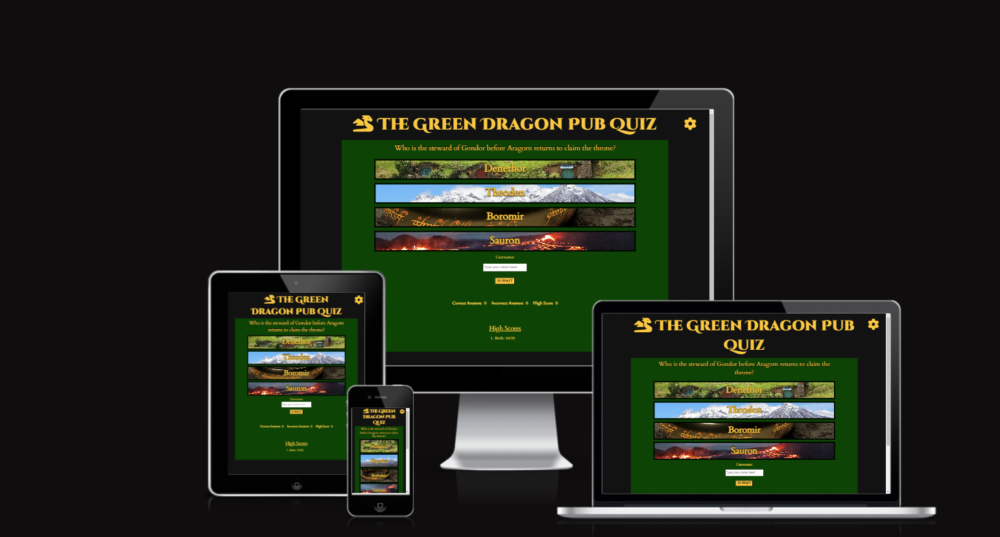
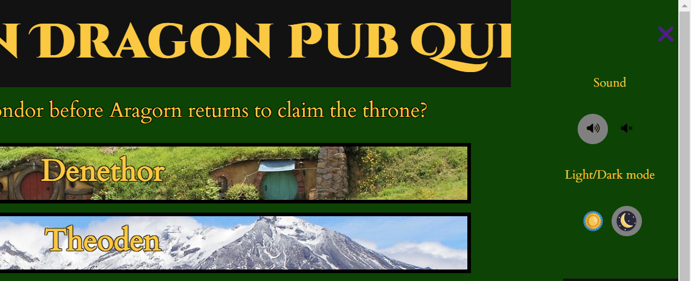
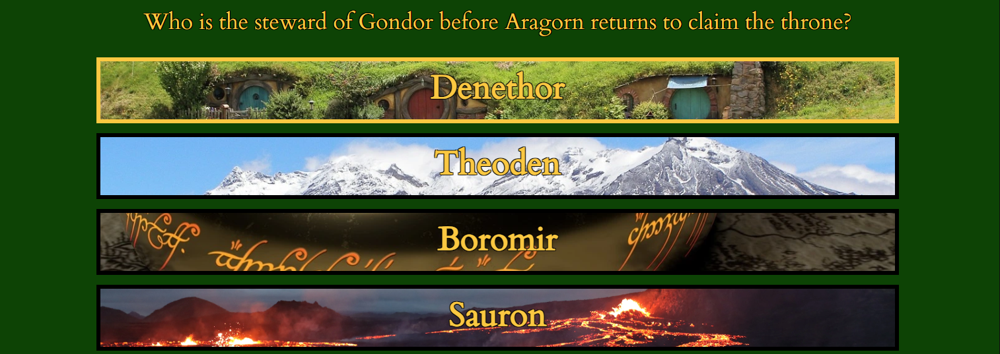
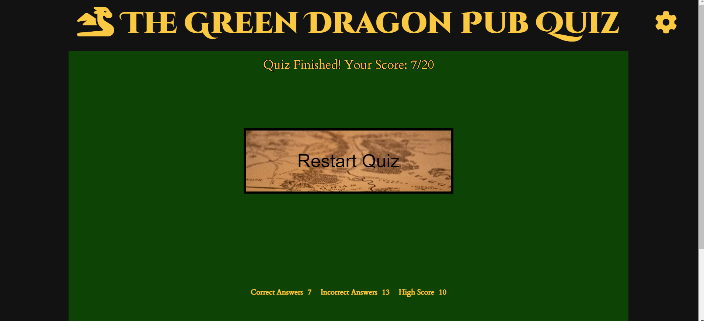

# The Green Dragon Pub Quiz
The Green Dragon Pub Quiz is an interactive, JavaScript based quiz game which tests the users knowledge on The Lord of The Rings universe. The site provides visual and audio feedback depending if the correct or incorrect answer is selected. User high scores are also recorded alongside their username, creating a fun and competitive environment. 

## [Link to live site](https://ktc96.github.io/TheGreenDragonPubQuiz/)

## Contents

1. [User Experience](#user-experience)
   * [User Stories](#user-stories)
2. [Design](#design)
   * [Colour Scheme](#colour-scheme)
   * [Typography](#typography)
   * [Imagery](#imagery)
   * [Wireframes](#wireframes)
3. [Features](#features)
   * [Future Implementations](#future-implementations)
   * [Accessibility](#accessibility)
4. [Technologies](#technologies)
   * [Languages](#languages)
   * [Frameworks, Libraries and Programs](#frameworks-libraries-and-programs)
5. [Testing](#testing)
6. [Deployment](#deployment)
7. [Credits](#credits)
   * [Code](#code)
   * [Content](#c)

## User Experience

### User Stories

* As a user of The Green Dragon Pub Quiz, I want to easily interact and play the quiz game, which is unique and engaging.
   * End user goal: Provide buttons for the user to select their answer, feedback if they get the answer correct and incorrect and challenging questions.
   * Acceptance criteria: Allow the user to navigate through the quiz, see if they got the question correct, and see their high score.

* As a user I want to be able to compete against friends
   * End user goal: Show high scores alongside usernames, allowing competition
   * Acceptance criteria: Sort highscores with JavaScript and return them alongside a submitted username.

* As a user I want to be able to control the theme of the site and control the sound
   * End user goal: Provide a light/ dark theme and a mute button.
   * Acceptance criteria: Create a settings menu with buttons which control global code through the use of JavaScript functions.

* As a user I want the quiz to be visually interesting and themed.
   * End user goal: Provide a well themed site in line with the Lord of The Rings Website.
   * Acceptance criteria: Use Lord Of the Rings inspired images, text and audio files to immerse the site user. 

## Design

### Colour Scheme
* I used a simple color scheme of green, black and gold to match the Lord of The Rings theme
 

Colour Scheme

 EDIT 

 

### Typography

 I used google fonts to browse fonts which fit my theme. I  decided on Cinzel decorative for my main heading and answer buttons and Cardo for other text.

### Imagery

### Wireframes

[Desktop_wireframe](/wireframes/Desktop-wireframe.png)
 
[Mobile_wireframe](/wireframes/Mobile-wireframe.png)
 

## Features

* Main heading
   * Clear title of the webpage with large stylised font to match the theme of the site
   * Responsive to screen size, wrapping onto multiple lines on smaller screens
   

* Settings menu
   * Accesible by clicking on the gear icon which plays a sound when interacted with
   * Menu allows control of global sound and also control of a light/ dark theme
   * These settings are saved to local storage allowing a better user experience

* Game area
   * Includes the question which is generated from a JavaScript array as well as answer buttons themed with Lord of The Rings locations
   * Buttons have a hover effect and can be clicked.
   * If the correct or incorrect answer is chosen a corrosponsing sound is heard and the correct and incorrect answers are highlighted in green or red.
   * The next question displays after a 4 second interval to allow the evaluate their choice.

* Username
   * In order to play the quiz, the user must input a username as the answer buttons are not interactable until then.
   * If a user trys to interact with the buttons before submitting a username, an alert pops up reminding them to do this. 
   * After the username is inputted a good luck message is displayed.

* Score area
   * As the user plays the quiz their tally of correct and incorrect answers is displayed along with the highest score.
   * The top three highest scores correlating to username are displayed also. 

* Restart quiz
   * At the end of the quiz the users final score is displayed and a finishing song is played.
   * The user is given the option to restart the quiz which, when clicked, resets the score

   

### Future Implementations

   * Increase the number of questions, and randomise the question selection so the quiz is different everytime to improve replay value. 
   * 
   * Link the quiz to a database to capture data so highscores can be tracked between users using different computers.

### Accessibility

To make my site suitable for those with accessibility issues I used semantic HTML, alt attributes and aria labels and ensured a high level of contrast between different site elements. 

## Technologies

### Languages

* HTML: HTML was used to create the basic architecture of the website and supply ID to elements I wanted to access with JavaScript.

* CSS: I used CSS to style the HTML elements, making them fit my website theme to improve the user experience.

* JavaScript: I used JavaScript to create a hamburger menu, to create a light/dark theme and to code the responsive quiz elements.

### Frameworks, Libraries and Programs

* [Font Awesome](https://fontawesome.com/): Font Awesome was used to select icons.
* [Am I Responsive](https://ui.dev/amiresponsive): Am I Responsive? was used to test website responsiveness.
* [Google Fonts](https://fonts.google.com/): Google Fonts was used to select the fonts.
* [Favicon](https://www.favicon.cc/): Favicon was used to design my favicon. 
* [Balsamiq](https://balsamiq.com/wireframes/?gclid=Cj0KCQiApKagBhC1ARIsAFc7Mc5DZfV_5VpnNDQFIuz5lMZ2IXecFdf7tkETd3vavZImeCymee0FHvQaAmZHEALw_wcB): Balsamiq was used to create the wireframes for the website. 
* [Pexels](https://www.pexels.com/): Pexels was used for copyright free images.
* [Unsplash](https://unsplash.com/): Unsplash was used for copyright free images.
* [CloudConvert](https://cloudconvert.com/): I used CloudConvert to change my images into webp format.

## Testing

I created a separate file to outline the testing I undertook on my project 

[Testing File](./testing.md)

## Deployment

* I deployed the site to GitHub pages. The steps to deploy the site are as follows:
   * In the GitHub repository, navigate to the Settings tab
   * From the source section drop-down menu, select the Master Branch
   * Once the master branch has been selected, the page will be automatically refreshed with a detailed ribbon display to indicate the successful deployment.

## Credits

### Code
* I used a hamburger menu similar to the one in my first project but I adapted it as a settings menu.
* I used the answer from Christopher Messer as a base to hide my Restart button until the quiz was completed  [Stackoverflow]( https://stackoverflow.com/questions/45602167/make-html-div-with-display-none-visible-again-loading-image-before-li).
* I used the answer from zer00ne as a base to restart my quiz [Stackoverflow](https://stackoverflow.com/questions/40371972/resetting-a-quiz-with-reset-button)
* I used the following webiste to learn about JavaScript flag variables to use in my quiz [Javascript-Kit](http://www.javascriptkit.com/javatutors/valid2.shtml)
* I used Log Rocket to learn about local Storage to save the site users high score [Log-Rocket](https://blog.logrocket.com/localstorage-javascript-complete-guide/#storing-data-browser-with-localstorage)
* I used Envato tuts to learn and implement a light/dark theme to my site [Envato-tuts](https://webdesign.tutsplus.com/tutorials/color-schemes-with-css-variables-and-javascript--cms-36989)
* I used W3 schools code as a base to set a timeout between answering a question and the next one loading [W3-Schools](https://www.w3schools.com/jsref/met_win_settimeout.asp)
* I read the answer from Kyle which allowed me to style my text with a shadow to fit the webiste theme [Stackoverflow](https://stackoverflow.com/questions/4919076/outline-effect-to-text)
* I used the code for the score area from the Love Maths project

### Content

Content for this website was written by Kyle Clow. The base for my quiz was this [Youtube](https://www.youtube.com/watch?v=PBcqGxrr9g8) tutorial. I mainly used stack overflow for any issues and inspoiration which I have credited in this file and as comments in my code. 

### Media

* The top three button images were taken from [Pexels](https://www.pexels.com/).  
* The bottom volcano image was taken from  [Unsplash](https://unsplash.com/).
* Audio was taken from 

### Acknowledgements

* The Slack Community for their guidance and support
* Jack Wachira my Code Institute Mentor, for his advice and help throughout my project

