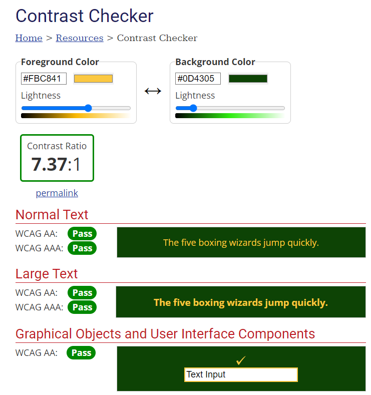
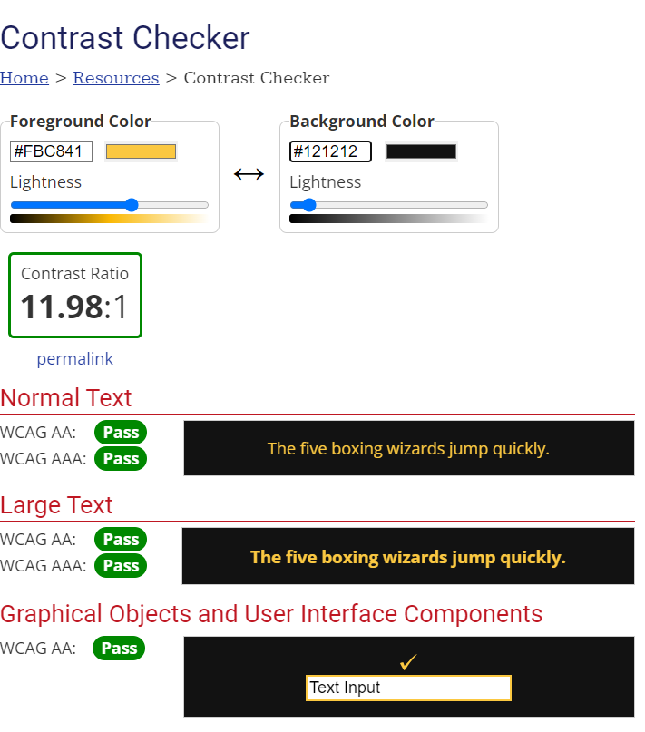

## Manual Testing

* I published my site via GitHub pages and shared with course mates to receive feedback. 

* Settings menu

    * I clicked on the settings button and the menu opened and the sound effect played
    * I clicked on the mute button and the sound across the site was muted
    * I refreshed the page and the mute button was still selected
    * I clikced on the light theme button and the theme changed
    * I refreshed the page and the mute button was still selected

* Username

    * When I tried to click and answer button a message was displayed informing me to input a username
    * When I clicked submit I was provided with a good luck message and I was able to answer quiz questions

* Questions and answers

    * When I hover over an answer button the border of the answer button is highlighted in gold
    * When I choose an correct answer the border and text is highlighted in green
    * When I choose an incorrect answer the border and text of the button I selected in highlighted in red and the correct answer is highlighted in green.
    * When I choose the correct/ incorrect answer the corrosponding scores are updated

## Bugs and issues

1. Aim: Make the title and settings button fully responsive across all screen sizes 

    * Issue:
At certain screen sizes the settings button overlapped with the website title

    * Solution:
increased the margin of the settings icon and decreased the font size of the main heading at smaller screen sizes

2. Aim: To have satisfactory scores for lighthouse testing

    * Issue: The performance of the site was lower than expected

    * Solution: I converted all png files into webp files to decrease loading time

    * Issue: My search engine optimisation could be improved

    * Solution: I increased the margin and the height of the username and submit boxes

3. Aim: Make the sound of the website muteable

    * Issue: I used one function to control audio on and off as a toggle, which meant the mute button could also be used to unmute the audio. 

    * Solution: I wrote another function so that they were specific

4. Aim: 

    * Issue: 

    * Solution:

Contrast:

I checked the contrast of the text elements of my site, using [WebAIM Contrast Checker](https://webaim.org/resources/contrastchecker/) to ensure my site met WCA guidelines.

Text contrast

 

## Post Development Testing

Validators

HTML - [https://validator.w3.org/nu/](https://validator.w3.org/nu/)

* All pages tested and no issues found

CSS - [https://jigsaw.w3.org/css-validator/](https://jigsaw.w3.org/css-validator/)

* All pages tested and no issues found

    

Javascript - [https://jshint.com/](https://jshint.com/)

* All JavaScript tested and recieved 53 warnings, all of which specify to ES6 (use 'esversion: 6') or Mozilla JS extensions (use moz).
* This testing also specified:

Two undefined variables
* 205	submit
* 222	submit
* 489	playSoundRestart
 

Six unused variables
* 92	soundOn
* 104	soundOff
* 142	openMenu
* 147	closeMenu
* 196	toggleTheme
* 357	username

Upon reviewing, everything was correct and there were no errors

### Lighthouse scores

